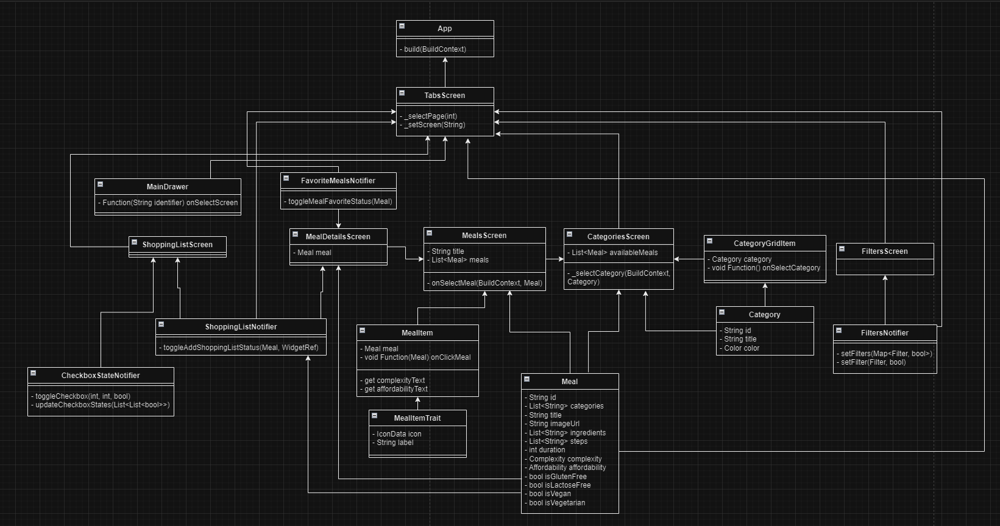
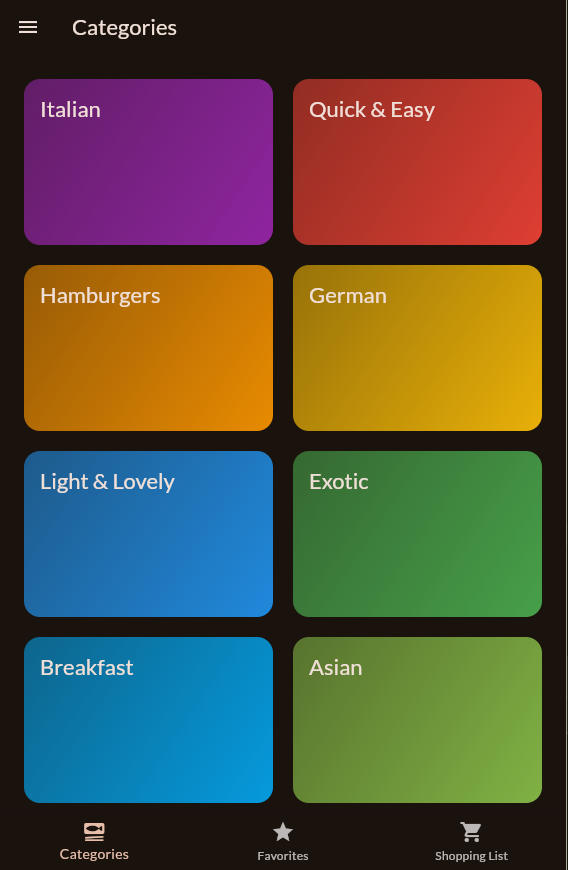
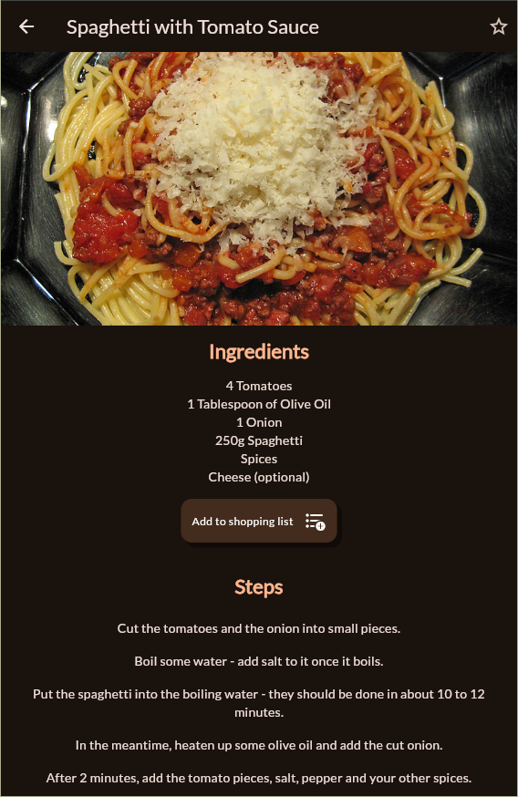
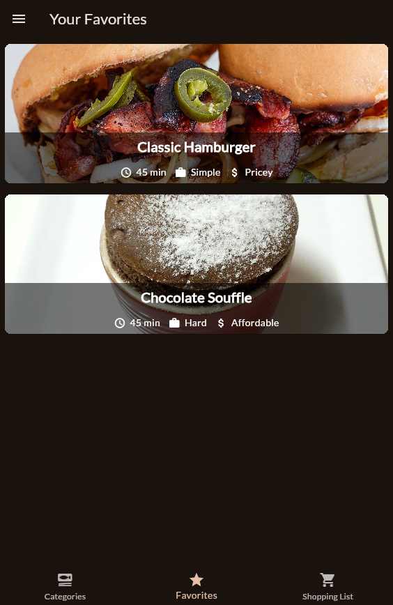
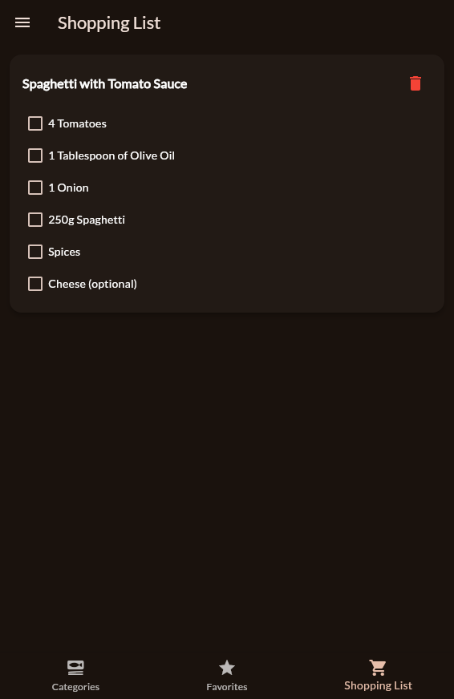

# meals-app Group 6
### Created by: Adrian Johansen & Di Xie

## App Architecture
The main.dart file contains the main App Widget. The structure of the application is sorted into folders. The data folder contains all the data that the project processes. The models folder contains Category objects and Meal objects of the data inside the dummy_data.dart file. The screens folder contains all the different screens that the app consists of. The widgets folder contains all the custom made widgets such as the drawer that appears on the main tabs screen and each individual meal containers. The providers folder contains all the providers used to save data between screens and to easily give access to certain values to certain screens.

## User Stories
As a user I want to get help with creating food.

As a user I want to be able to track what ingredients I need when creating certain dishes.

## Class Diagram

## Screenshots
Main Menu                  |  Dish details
:-------------------------:|:-------------------------:
  |  

Your Favourites            |  Shopping list
:-------------------------:|:-------------------------:
   |  
